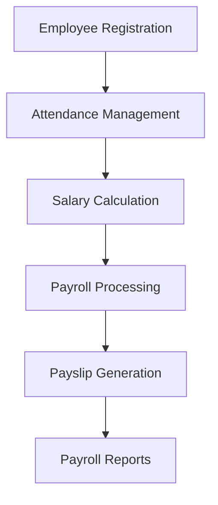

<div align="center">

# 💰📊 𝙋𝘼𝙔𝙍𝙊𝙇𝙇 𝙈𝘼𝙉𝘼𝙂𝙀𝙈𝙀𝙉𝙏 𝙎𝙔𝙎𝙏𝙀𝙈 📊💰


### 🚀 Smart Employee Salary & Payroll Management Solution

<br>


<br><br>


</div>

---

# 📌 About The Project

> **Payroll Management System** is a smart and efficient solution designed to automate employee salary calculations, payroll processing, attendance tracking, and employee management.

This project helps organizations reduce manual payroll work and improve salary management accuracy through a digital payroll platform. Payroll systems commonly streamline salary calculations, deductions, attendance tracking, and report generation for organizations. :contentReference[oaicite:0]{index=0}

✨ The system provides:

- 💰 Salary management
- 👨‍💼 Employee record handling
- 📊 Payroll automation
- 📅 Attendance tracking
- 🧾 Payslip generation
- 🔐 Secure employee data management

---

# ✨ Features

<div align="center">

| 🚀 Feature | 💡 Description |
|---|---|
| 👨‍💼 Employee Management | Add, update & manage employees |
| 💰 Payroll Calculation | Automatic salary calculations |
| 📅 Attendance Tracking | Monitor employee attendance |
| 🧾 Payslip Generation | Generate salary slips |
| 🔐 Secure Login System | Protected user access |
| 📊 Payroll Reports | Salary & employee analytics |
| ⚡ Fast Processing | Efficient payroll automation |
| ☁️ Database Integration | Secure data storage |

</div>

---

# 🛠️ Tech Stack

<div align="center">

| Technology | Purpose |
|---|---|
| 💻 JavaScript | Application Logic |
| ⚡ Node.js | Backend Runtime |
| 🚀 Express.js | Server Framework |
| 🗄️ MongoDB / MySQL | Database |
| 🎨 HTML/CSS | Frontend Design |
| 🔐 Authentication | Secure Login |
| 📊 Dashboard UI | Payroll Analytics |

</div>

---

# 📂 Project Structure

```bash
Payroll-Management-System/
│
├── public/
│   ├── css/
│   ├── js/
│   └── images/
│
├── views/
│
├── models/
├── routes/
├── database/
│
├── app.js
├── package.json
└── README.md
```

---

# ⚙️ Installation

## 🔽 Clone Repository

```bash
git clone https://github.com/Abhijit-Bhattacharjee/Payroll-Management-System.git
```

## 📂 Open Project Folder

```bash
cd Payroll-Management-System
```

## 📦 Install Dependencies

```bash
npm install
```

## ▶️ Start Application

```bash
node app.js
```

---

# 🌍 Local Preview

```bash
http://localhost:3000
```

---

# 🔄 System Workflow



---

# 🎯 Objectives

- 💰 Automate payroll calculations
- 👨‍💼 Improve employee management
- 📊 Reduce manual payroll errors
- ⚡ Increase payroll efficiency
- 🔐 Secure salary information
- ☁️ Create scalable payroll infrastructure

---

# 📈 Payroll Functionalities

<div align="center">

| Module | Purpose |
|---|---|
| 👨‍💼 Employee Module | Manage employee records |
| 📅 Attendance Module | Track attendance & leaves |
| 💰 Salary Module | Calculate salary & deductions |
| 🧾 Payslip Module | Generate payroll slips |
| 📊 Reports Module | Payroll analytics & reports |

</div>

---

# 🔐 Security Features

```diff
+ Secure User Authentication
+ Employee Data Protection
+ Payroll Data Encryption
+ Secure Database Access
+ Role-Based Authorization
```

---

# 📸 Preview

<div align="center">


</div>

---

# 🚀 Future Enhancements

- 📱 Mobile Payroll App
- 🤖 AI Salary Prediction
- 🌐 Cloud Deployment
- 📊 Advanced Analytics Dashboard
- 📧 Email Payslip System
- 🧬 Employee Performance Tracking
- 🌙 Dark Mode Support

---

# 👨‍💻 Developer

<div align="center">

## 🚀 Abhijit Bhattacharjee

### 🌟 Full Stack Developer & Software Enthusiast

GitHub: [Abhijit Bhattacharjee GitHub](https://github.com/Abhijit-Bhattacharjee?utm_source=chatgpt.com)

</div>

---

# 🤝 Contribution

Contributions are always welcome ❤️

```bash
1. Fork Repository
2. Create Feature Branch
3. Commit Changes
4. Push To GitHub
5. Open Pull Request
```

---

# ⭐ Support

If you like this project:

🌟 Star this repository  
🍴 Fork this project  
📢 Share with others  

---

<div align="center">


# 💙 Smart Payroll Management For Modern Organizations

### ✨ Automating Payroll Through Technology ✨

</div>
